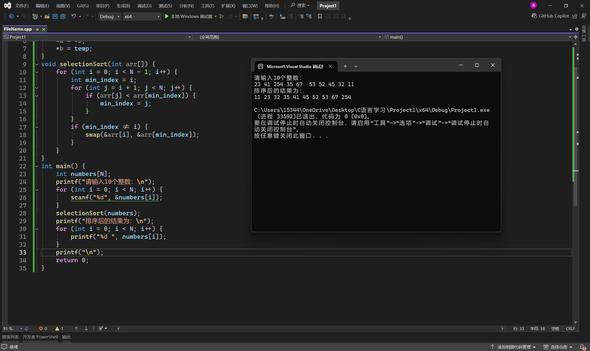
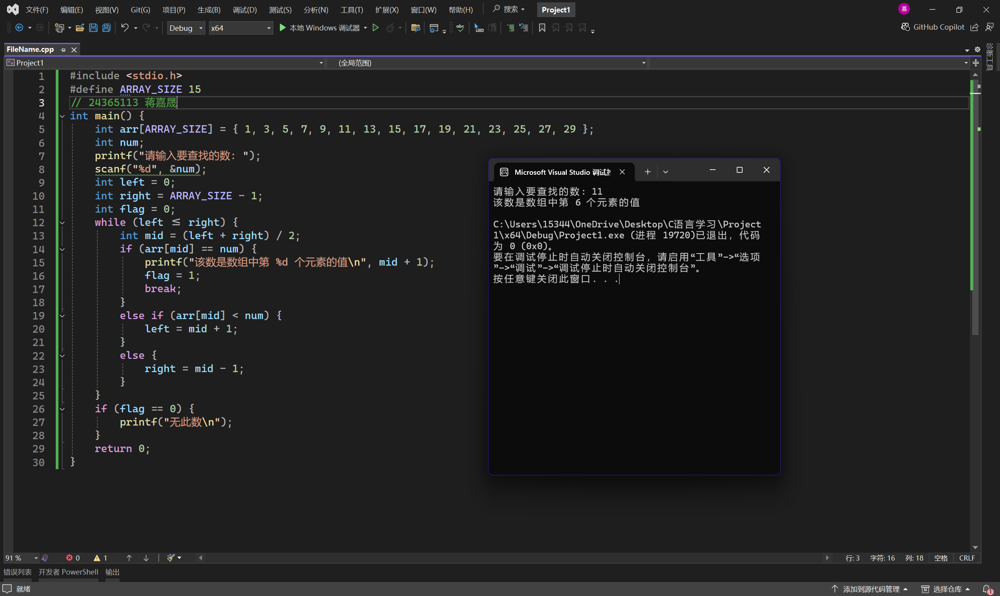
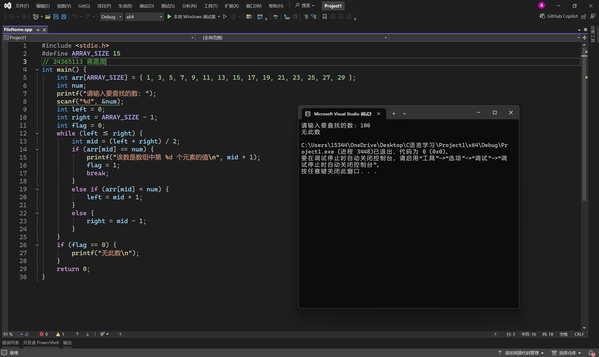
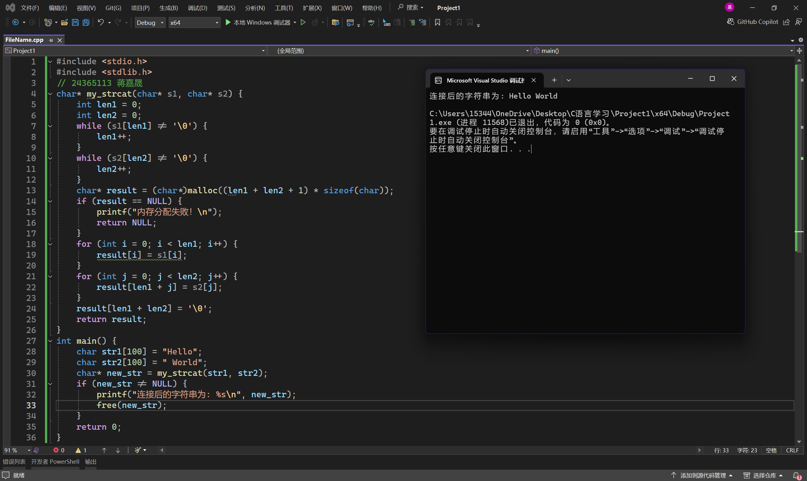
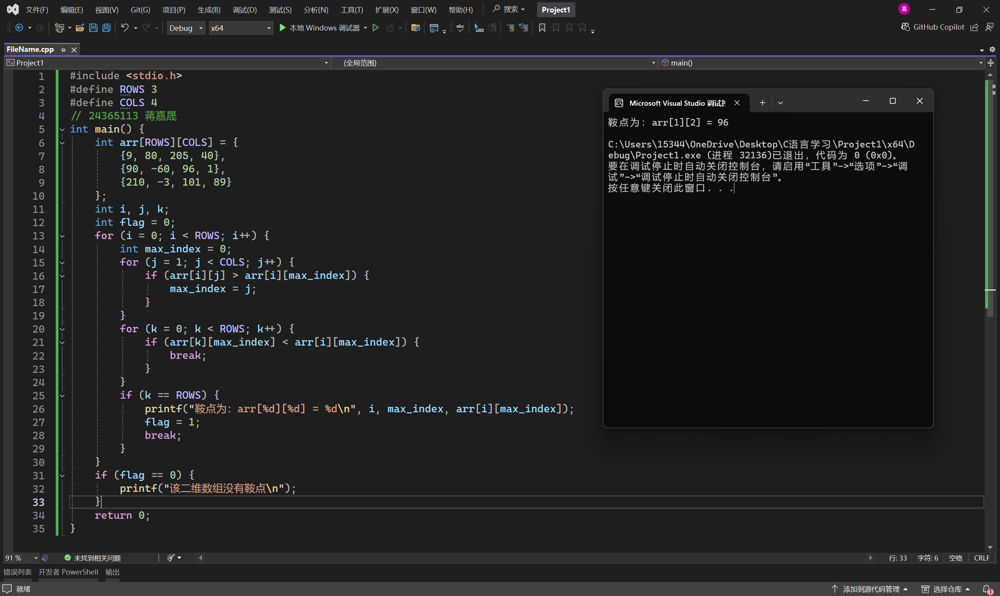

# 实验五 数组

## 一、实验目的
1. 掌握一维数组和二位数组的定义、赋值和输入输出的方法。
2. 掌握字符数组和字符串函数的使用。
3. 掌握与数组有关的算法（特别是排序算法）。

## 二、实验准备
1. 复习数组的基本知识。
2. 复习字符串数组的特点和常用的字符串处理函数。

## 三、实验内容
编写下列问题的源程序并上机调试运行。
1、用选择法对 10 个整数排序(10 个整数用 scanf 函数输入)。
程序示例
```
#include <stdio.h>

#define N 10

// 交换两个整数的值
void swap(int *a, int *b) {
    int temp = *a;
    *a = *b;
    *b = temp;
}

// 选择排序函数
void selectionSort(int arr[]) {
    for (int i = 0; i < N - 1; i++) {
        int min_index = i;
        for (int j = i + 1; j < N; j++) {
            if (arr[j] < arr[min_index]) {
                min_index = j;
            }
        }
        if (min_index!= i) {
            swap(&arr[i], &arr[min_index]);
        }
    }
}

int main() {
    int numbers[N];
    printf("请输入10个整数：\n");
    for (int i = 0; i < N; i++) {
        scanf("%d", &numbers[i]);
    }

    selectionSort(numbers);

    printf("排序后的结果为：\n");
    for (int i = 0; i < N; i++) {
        printf("%d ", numbers[i]);
    }
    printf("\n");

    return 0;
}
```



2、有 15 个数存放在一个数组中，输入一个数，要求用折半查找法找出该数是数组中第几个
元素的值。如果该数不在数组中，则输出“无此数”。15 个数用赋初值的方法在程序中给出。
要找的数用 scanf 函数输入。
代码示例
```
#include <stdio.h>

// 定义数组长度
#define ARRAY_SIZE 15

int main() {
    int arr[ARRAY_SIZE] = {1, 3, 5, 7, 9, 11, 13, 15, 17, 19, 21, 23, 25, 27, 29};
    int num;
    printf("请输入要查找的数: ");
    scanf("%d", &num);

    int left = 0;
    int right = ARRAY_SIZE - 1;
    int flag = 0;  // 标记是否找到的标志，0表示未找到

    while (left <= right) {
        int mid = (left + right) / 2;
        if (arr[mid] == num) {
            printf("该数是数组中第 %d 个元素的值\n", mid + 1);
            flag = 1;
            break;
        } else if (arr[mid] < num) {
            left = mid + 1;
        } else {
            right = mid - 1;
        }
    }

    if (flag == 0) {
        printf("无此数\n");
    }

    return 0;
}
```





3、将两个字符串连接起来，不要用 strcat 函数。
代码示例
```
#include <stdio.h>
#include <stdlib.h>

// 自定义函数用于连接两个字符串
char* my_strcat(char* s1, char* s2) {
    int len1 = 0;
    int len2 = 0;
    // 计算第一个字符串s1的长度
    while (s1[len1]!= '\0') {
        len1++;
    }
    // 计算第二个字符串s2的长度
    while (s2[len2]!= '\0') {
        len2++;
    }
    // 重新分配内存空间，长度为两个字符串长度之和再加1（用于存放'\0'结束符）
    char* result = (char*)malloc((len1 + len2 + 1) * sizeof(char));
    if (result == NULL) {
        printf("内存分配失败！\n");
        return NULL;
    }
    // 先将s1的字符逐个复制到result中
    for (int i = 0; i < len1; i++) {
        result[i] = s1[i];
    }
    // 再将s2的字符逐个复制到result中紧跟s1字符后面的位置
    for (int j = 0; j < len2; j++) {
        result[len1 + j] = s2[j];
    }
    // 在末尾添加字符串结束符'\0'
    result[len1 + len2] = '\0';
    return result;
}

int main() {
    char str1[100] = "Hello";
    char str2[100] = " World";
    char* new_str = my_strcat(str1, str2);
    if (new_str!= NULL) {
        printf("连接后的字符串为: %s\n", new_str);
        free(new_str);  // 释放动态分配的内存
    }
    return 0;
}
```



4、找出一个二维数组的“鞍点”，即该位置上的元素在该行上最大，在该列上最小。也可能
没有鞍点。此二维数组可以设定如下，其中，数组元素的值用赋初值方法在程序中指定。

```
9 80 205 40
90 -60 96 1
210 -3 101 89
```

代码示例

```
#include <stdio.h>

#define ROWS 3
#define COLS 4

int main() {
    int arr[ROWS][COLS] = {
        {9, 80, 205, 40},
        {90, -60, 96, 1},
        {210, -3, 101, 89}
    };
    int i, j, k;
    int flag = 0;  // 用于标记是否找到鞍点，0表示未找到

    // 遍历每一行
    for (i = 0; i < ROWS; i++) {
        int max_index = 0;  // 先假设每行第一个元素是最大的，记录其列下标
        // 找出当前行的最大值及其所在列下标
        for (j = 1; j < COLS; j++) {
            if (arr[i][j] > arr[i][max_index]) {
                max_index = j;
            }
        }

        // 检查该最大值在其所在列是否为最小
        for (k = 0; k < ROWS; k++) {
            if (arr[k][max_index] < arr[i][max_index]) {
                break;
            }
        }

        // 如果内层循环正常结束（没有因更小值而break），说明找到了鞍点
        if (k == ROWS) {
            printf("鞍点为：arr[%d][%d] = %d\n", i, max_index, arr[i][max_index]);
            flag = 1;
            break;  // 找到鞍点后就不用继续找了，直接退出外层循环
        }
    }

    if (flag == 0) {
        printf("该二维数组没有鞍点\n");
    }

    return 0;
}
```


